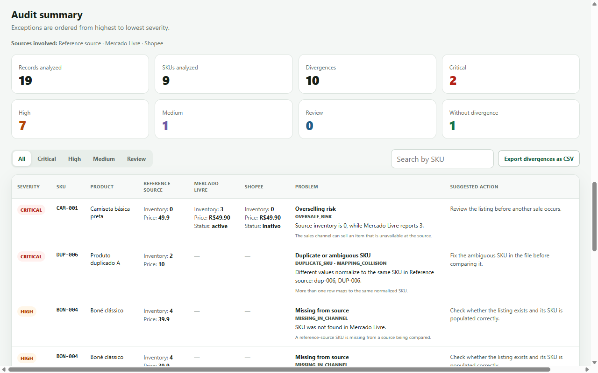
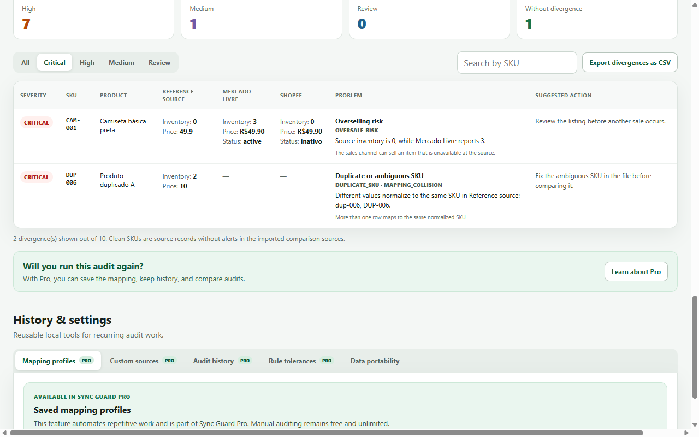

# Marketplace Sync Guard

**Free Chrome extension for e-commerce and marketplace operations.**

Marketplace Sync Guard compares CSV/XLSX exports from ERP systems and sales channels to detect mismatches in **inventory, price, SKU, product presence, duplicates and status** before they turn into overselling, lost sales or catalog errors.

## Try it

- Chrome Web Store: https://chromewebstore.google.com/detail/marketplace-sync-guard/dnmpgmjoadamfgdoemcifmgdijapklbf
- Website: https://syncguard.lumenanima.com/
- Portuguese: https://syncguard.lumenanima.com/pt-br/
- Spanish: https://syncguard.lumenanima.com/es/

## Why it exists

Marketplace and ERP integrations can finish without an obvious error while the resulting catalog data is still inconsistent. Sync Guard adds an independent reconciliation layer using exports you already control.

## Core principles

- **Local-first:** imported operational files stay on the user's device.
- **Read-only:** the extension does not modify listings, inventory or prices.
- **No marketplace credentials:** audits work from CSV/XLSX exports.
- **Free core:** unlimited manual audits.
- **Multilingual:** English, Portuguese and Spanish.

## Checks

- Inventory / stock differences
- Price mismatches
- SKU inconsistencies
- Missing products / presence differences
- Duplicate records
- Status differences

## Founder Pro

Founder Pro adds productivity features such as saved mapping profiles, custom source presets, local audit history, audit comparison and custom price tolerances.

Purchase and activation details are available on the website.

## Screenshots

---

Built by **Lumen Anima Labs**.
